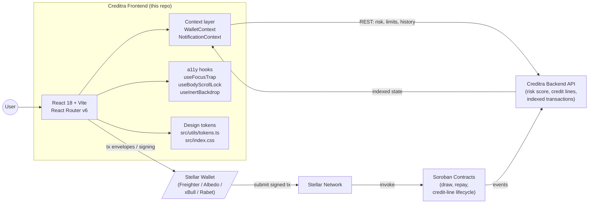

# Creditra Frontend

> Decentralized, risk-priced credit on Stellar — **without overcollateralization**.

Creditra evaluates on-chain behavior to underwrite credit lines and price them dynamically.
This repository is the user-facing surface of the protocol: the dashboard, credit-line
manager, draw/repay flows, wallet integration, and transaction history that borrowers and
lenders interact with.

The Soroban contracts and risk-scoring backend live in companion repositories. The
frontend is intentionally decoupled from both — it speaks REST to the indexer/backend and
talks to Stellar wallets via injected provider APIs.

---

## What makes this frontend different

- **No collateral lock-in UX.** The flows assume credit terms come from a *risk score*, not
  a collateral ratio. The dashboard surfaces the risk gauge prominently
  (`src/pages/Dashboard.tsx`) and the draw wizard validates against `available` credit
  rather than a deposit balance (`src/utils/amountValidation.ts`).
- **Multi-wallet, single context.** Freighter, Albedo, xBull, and Rabet are normalised into
  a single `WalletInfo` shape (`src/utils/wallet.ts`) behind one
  `WalletProvider` (`src/context/WalletContext.tsx`).
- **WCAG 2.1 AA by default.** Three composable hooks
  (`useFocusTrap`, `useBodyScrollLock`, `useInertBackdrop`) standardise every modal.
  Every interactive element meets the 44×44 px touch target.
- **Token-first styling.** Color, spacing, radius and elevation tokens live in
  `:root` (`src/index.css`) and `src/utils/tokens.ts`. One-off hex values are a
  review-blocker.
- **Tested where it counts.** 75 tests across 18 files — focus-trap, modal a11y, amount
  validation, currency/date formatters, error boundaries, copy-to-clipboard.

---

## Architecture at a glance



See [`docs/ARCHITECTURE.md`](docs/ARCHITECTURE.md) for the full component topology and
data-flow diagrams.

---

## Quick start

### Prerequisites

- Node.js 18+
- npm 9+ (we ship `package-lock.json`; a stale `pnpm-lock.yaml` exists for reference but
  npm is the source of truth)

### Install, run, test, build, lint

```bash
npm install
npm run dev        # vite dev server on http://localhost:5173
npm test           # vitest in watch mode
npm test -- --run  # one-shot test run
npm run build      # tsc -b && vite build (writes ./dist)
npm run preview    # serve ./dist locally
npm run lint       # eslint .
```

### Environment

```env
VITE_API_URL=http://localhost:3000          # backend base URL, read via import.meta.env
VITE_REPAY_CONFIRM_THRESHOLD=5000           # USD amount above which repayments require typed confirmation (default: 5000)
```

`VITE_REPAY_CONFIRM_THRESHOLD` controls the typed-amount guard in the repayment flow.
When a repayment amount meets or exceeds this value, the review step shows a confirmation
input where the user must type the exact amount before the "Confirm Repayment" button
enables. Set to `0` to disable the guard entirely (not recommended for production).

---

## Feature inventory

Every entry below is grounded in a real file in `src/`.

### Pages (routes wired in [`src/App.tsx`](src/App.tsx))

| Route | Component | Purpose |
| --- | --- | --- |
| `/` | `pages/Dashboard.tsx` | Risk gauge, credit summary, recent transactions, wallet chip |
| `/credit-lines` | `pages/CreditLines.tsx` | Credit-line list with sort by status/limit/utilization/APR/risk |
| `/transactions` | `pages/TransactionHistory.tsx` | Filterable transaction ledger with sortable headers |
| `/repay` | `pages/RepayPage.tsx` | Repay flow with Smart Pay suggested amount, percent presets, review step |
| `/draw-credit` | `pages/DrawCreditPage.tsx` | 4-step wizard: select → amount → confirm → status |
| `/open-credit` | `pages/RequestEvaluation.tsx` | Onboarding evaluation form |
| `*` | `pages/NotFound.tsx` | 404 with semantic landmarks |

Auth pages (`LoginPage`, `RegisterPage`, `ForgotPasswordPage`, `ResetPasswordPage`) and a
public `LandingPage` exist as components, ready to be wired into the route tree.

### Reusable components ([`src/components/`](src/components/))

- **Inputs / forms:** `FormField`, `FormMessage`, `AmountInput`, `PendingButton`
- **Status & feedback:** `StatusBadge`, `NetworkStatus`, `Skeleton`, `SuccessState`, `TransactionStatus`,
  `ErrorBoundary`
- **Overlay:** `WalletConnectionModal`, `RepayModal`, `OnboardingFlow`
- **Wallet:** `WalletButton`
- **Credit-line UI:** `CreditLineSelector`, `CreditLineSummaryBlock`, `PreviewSection`,
  `ConfirmationStep`
- **A11y primitives:** `AccessibleTooltip`, `CopyToClipboard`
- **Notifications system** ([`src/components/notifications/`](src/components/notifications/)):
  `NotificationBell`, `NotificationCenter`, `ToastContainer`, `BannerAlert`

### Hooks ([`src/hooks/`](src/hooks/))

- `useFocusTrap` — Tab/Shift+Tab cycling, return-focus to trigger, Escape close
- `useBodyScrollLock` — preserves scroll position across modal open/close
- `useInertBackdrop` — `inert` attribute with `aria-hidden` + `pointer-events` fallback

### Cross-cutting context ([`src/context/`](src/context/))

- `WalletContext` — connection lifecycle (`disconnected | connecting | connected | error`),
  persisted preference, typed error discriminators
- `NotificationContext` — toasts, banners, per-category preferences, persisted inbox

### Utilities ([`src/utils/`](src/utils/))

`amountValidation`, `classnames`, `clipboard`, `currency`, `dates`, `format-address`,
`password-strength`, `storage`, `suggestRepay`, `tokens`, `wallet` — all unit-tested.

---

## Engineering principles

1. **Accessibility is not optional.** Every modal composes the three a11y hooks. Every
   icon-only button has an `aria-label`. Color is never the sole signal —
   `StatusBadge` pairs color with a glyph (`A`, `!`, `X`, `C`). See
   [`docs/ACCESSIBILITY.md`](docs/ACCESSIBILITY.md).
2. **Type safety end to end.** `strict: true`, `noUnusedLocals`, `noUnusedParameters`
   in [`tsconfig.json`](tsconfig.json). Discriminated unions are used for wallet errors,
   connection status, and notification types.
3. **Design tokens over magic values.** Colors and spacing referenced from
   `src/utils/tokens.ts` and `:root` custom properties — never inline hex.
4. **State boundaries are explicit.** Cross-screen state lives in a Context provider; local
   state lives in the page component. No Redux/Zustand/Recoil.
5. **Mock-first, contract-later.** `src/data/mockData.ts` and
   `src/lib/draw-credit-mock-data.ts` model the API shape so UI work and contract work can
   proceed in parallel.

---

## Documentation map

| File | What it covers |
| --- | --- |
| [`docs/ARCHITECTURE.md`](docs/ARCHITECTURE.md) | Component topology, data flow, routing, state, error/loading policy |
| [`docs/DESIGN_SYSTEM.md`](docs/DESIGN_SYSTEM.md) | Token catalogue, component library, theming, motion, density |
| [`docs/ACCESSIBILITY.md`](docs/ACCESSIBILITY.md) | WCAG 2.1 AA conformance, per-pattern guidance, audit table |
| [`docs/UX_RATIONALE.md`](docs/UX_RATIONALE.md) | Why each major flow looks the way it does — alternatives considered |
| [`docs/PERFORMANCE.md`](docs/PERFORMANCE.md) | LCP/INP/CLS budgets, code-splitting, bundle budgets per route |
| [`docs/TESTING.md`](docs/TESTING.md) | Test pyramid, coverage status, how to run each tier |
| [`docs/CONTRIBUTING.md`](docs/CONTRIBUTING.md) | Conventional commits, branch model, review checklist |
| [`Design System/`](Design%20System/) | Figma source-of-truth references for tokens, components, alerts, interaction |

The deep-dive markdown files (`WALLET_IMPLEMENTATION.md`, `USER_FLOWS.md`,
`COMPONENT_SPECS.md`, `VISUAL_STATES.md`, `SUCCESS_STATE_PATTERNS.md`, etc.) remain at the
repo root as historical context.

---

## Contributing UI changes

All UI changes must pass an accessibility review. Include this checklist in your PR:

```markdown
### Accessibility Check

- [ ] Keyboard navigation works (Tab, Shift+Tab, Enter, Escape)
- [ ] Focus indicators are clearly visible (2px outline, 2px offset)
- [ ] Contrast ratios meet WCAG AA (4.5:1 text, 3:1 large text/icons)
- [ ] Touch targets are at least 44×44 px
- [ ] Semantic HTML and ARIA roles/labels are used
- [ ] `prefers-reduced-motion` is respected
```

See [`docs/CONTRIBUTING.md`](docs/CONTRIBUTING.md) and [`CHECKLIST.md`](CHECKLIST.md) for
the full review checklist.

---

## Project layout

```
src/
├── App.tsx              Routes + global providers
├── main.tsx             ReactDOM bootstrap inside StrictMode
├── pages/               Route-level components
├── components/          Reusable UI (incl. notifications/)
├── context/             WalletContext, NotificationContext
├── hooks/               useFocusTrap, useBodyScrollLock, useInertBackdrop
├── utils/               Pure helpers — formatting, validation, tokens, wallet glue
├── types/               Shared TS types and discriminated unions
├── lib/                 External integrations and mock data
├── data/                Mock fixtures (mirrors backend shape)
├── test/                Vitest setup
└── index.css            Global CSS custom properties and base styles
```
