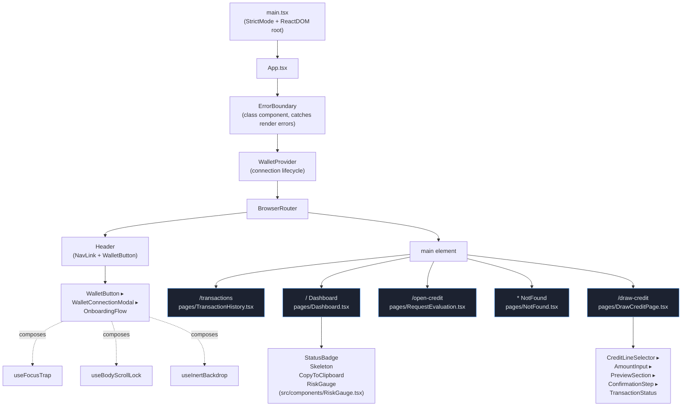
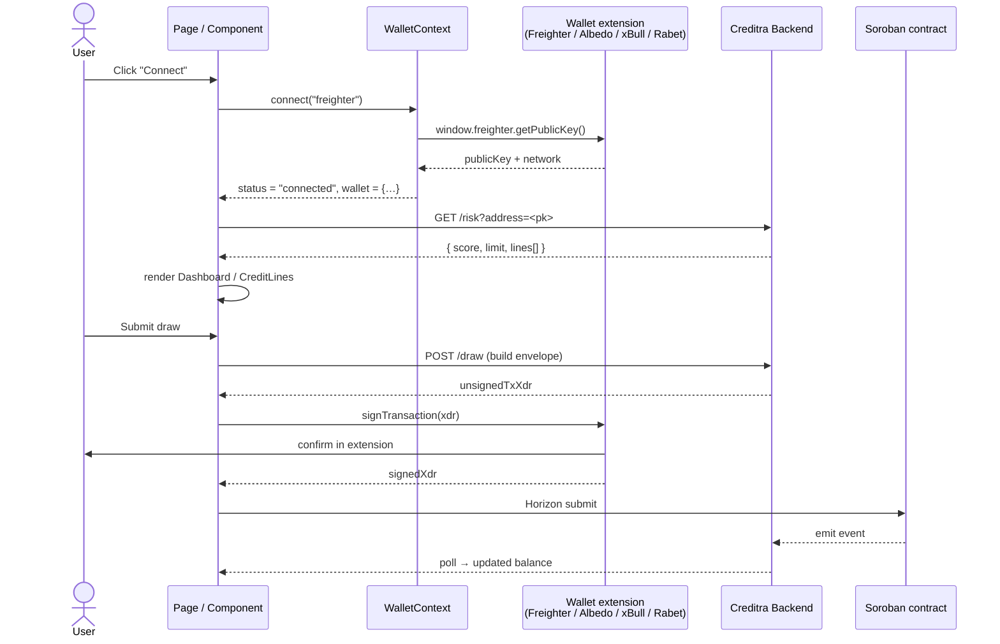
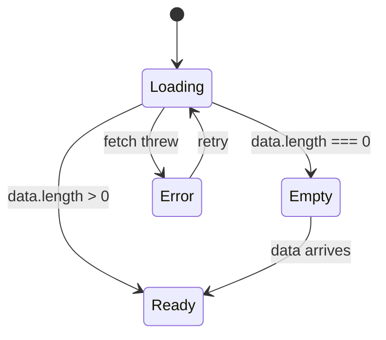

# Architecture

This document is the frontend's system-design reference. It is grounded in the actual
files under `src/` — every component, hook, and provider named below is a real export.

The intent: a reviewer should be able to read this in five minutes and understand how a
user click becomes a network request, how a wallet signature flows back into the UI, and
where the boundaries of responsibility sit.

---

## 1. Component topology



The header is rendered outside `<Routes>` so it persists across navigation. The
`ErrorBoundary` is wrapped *outside* `WalletProvider` so that even a failure inside the
wallet reducer renders the error page instead of a blank screen.

---

## 2. Data flow

The app is a client-rendered SPA. There is no SSR. Soroban contract calls are signed
client-side by the connected wallet extension; the backend exposes read-only views over
the indexer.



### What the frontend never does

- **It never holds a secret key.** All signing happens inside the wallet extension; the
  frontend only ever sees public keys and signed XDR envelopes.
- **It never re-derives risk.** The risk score is authoritative on the backend; the UI
  renders it but cannot influence it.
- **It never trusts client time for amounts.** Validation in
  `src/utils/amountValidation.ts` is a UX guard rail only; the contract is the source of
  truth.

---

## 3. State management

The store is deliberately small. We do not use Redux, Zustand, Recoil, or React Query.

| State | Lives in | Persistence |
| --- | --- | --- |
| Wallet connection lifecycle | `src/context/WalletContext.tsx` | `localStorage` via `src/utils/wallet.ts` (`saveWalletPreference`, `getStoredWallet`) |
| Toasts and banners | `src/context/NotificationContext.tsx` | In-memory; preferences and inbox persisted to `localStorage` |
| Colour-scheme theme | `src/context/ThemeContext.tsx` | `localStorage` key `creditra-theme` via `src/utils/storage.ts` |
| High-contrast override | `src/context/ContrastContext.tsx` | `localStorage` key `creditra-contrast` via `src/utils/storage.ts` |
| Page-local form state | The page component (e.g. `pages/DrawCreditPage.tsx`) | None — destroyed on navigation |
| Wizard step | `useState` in the wizard root (`DrawCreditPage`) | URL parameters drive the success state via `useLocation().state` |

**Why no global state library?** The state graph is shallow. Wallet info, notification
queue, and UI ephemera don't share enough surface area to justify a reducer framework. The
trade-off is documented in [`docs/UX_RATIONALE.md`](UX_RATIONALE.md).

### WalletContext reducer-shaped API

`WalletContext` exposes a tiny surface:

```ts
interface WalletContextType {
  wallet: WalletInfo | null;
  status: 'disconnected' | 'connecting' | 'connected' | 'error';
  error: WalletError | null;
  connect: (type: WalletType) => Promise<void>;
  disconnect: () => void;
  clearError: () => void;
}
```

`WalletError` is a discriminated union — consumers branch on `error.type` to render
specific recovery UI:

```ts
type WalletError =
  | { type: 'not_found';        message: string }
  | { type: 'connection_failed'; message: string }
  | { type: 'wrong_network';     message: string }
  | { type: 'user_rejected';     message: string };
```

### NotificationContext

`NotificationContext` is more ambitious. It holds:

- `toasts` — transient stack, auto-dismissed
- `banners` — page-level alerts, persist until dismissed
- `notifications` — inbox, persisted to `localStorage` capped at 100 entries
- `preferences` — per-category mute switches (`transaction`, `credit_line`, `risk_score`,
  `rate_change`, `system`)
- `unreadCount`, `markAsRead`, `markAllAsRead`, `clearAll`
- `isPanelOpen` + open/close handlers for the `NotificationCenter`

Each notification carries a `category` so users can mute classes (e.g. silence rate-change
notifications while keeping transaction confirmations).

---

## 4. Routing

| Path | Element | Notes |
| --- | --- | --- |
| `/` | `<Dashboard />` | Default landing for a connected wallet |
| `/transactions` | `<TransactionHistory />` | Sortable, filterable ledger |
| `/credit-lines` | route is rendered in the nav but currently delegates to `pages/CreditLines.tsx`; wiring happens via `App.tsx` updates |
| `/draw-credit` | `<DrawCreditPage />` | 4-step wizard |
| `/draw-credit/success` | `<DrawCreditPage />` | Same component, success branch driven by `useLocation().state.transaction` |
| `/open-credit` | `<RequestEvaluation />` | New-applicant intake |
| `*` | `<NotFound />` | Semantic 404 with link back to `/` |

### Code-splitting

The current build emits a single bundle; the routes above are imported eagerly in
`App.tsx`. The infrastructure for per-route splitting is in place — every page is a
default-exportable component — and the recommended next step is to convert each route
import to `lazy(() => import(...))` and wrap `<Routes>` in `<Suspense fallback={<Skeleton/>}>`.
See [`PERFORMANCE.md`](PERFORMANCE.md) for the rollout plan and per-route bundle budgets.

---

## 5. Error and loading state policy

Every screen that fetches data follows the same four-state pattern:



| State | Visual | Component |
| --- | --- | --- |
| Loading | Shimmer matching the final layout | `components/Skeleton.tsx` (`Skeleton.css` animation, `prefers-reduced-motion` disables shimmer) |
| Empty | Illustration + primary CTA to populate | inline per page (e.g. Dashboard's "no credit lines" state) |
| Error | Banner + retry, or full-page `ErrorBoundary` if render-time | `components/ErrorBoundary.tsx` for render errors, `BannerAlert` for fetch errors |
| Ready | Real data | the screen |

The `ErrorBoundary` lives at the very top of `App.tsx` so a panicking render anywhere in
the tree falls back to a labelled error page with a "Go back" and "Reload" pair (see
`src/pages/ErrorPage.css`).

---

## 6. Accessibility primitives

Three hooks compose to form every modal/sheet contract.

- **`useFocusTrap({ isActive, triggerRef, onEscape })`** — moves focus into the container
  on activation, cycles Tab/Shift+Tab within it, calls `onEscape` on the Escape key, and
  returns focus to `triggerRef` (or the previously focused element) on close.
- **`useBodyScrollLock({ isLocked })`** — freezes background scroll by stashing the
  scroll position into `body.style.top` and restoring it on unmount.
- **`useInertBackdrop({ isInert, modalId })`** — walks the DOM and applies the native
  `inert` attribute to every element outside the modal container; falls back to
  `aria-hidden="true"` + `pointer-events: none` for older browsers and restores prior
  attribute state on cleanup.

The `WalletConnectionModal` composes all three. Any future modal must too — failing to
do so is a review blocker.

---

## 7. Design tokens

Tokens are co-located in two places:

- **Runtime CSS variables** in `src/index.css` (`--bg`, `--surface`, `--accent`,
  `--space-*`, `--radius-*`, `--lh-*`). These are the values components read at paint
  time.
- **TypeScript token module** at `src/utils/tokens.ts`. Exports `COLOR`, `UTIL_COLOR`,
  `STATUS_COLOR`, `RISK_COLOR`, ready-made `btn` style objects, and formatters (`fmt`,
  `fmtDate`, `fmtDateTime`). Imported by inline-styled components like `Dashboard`'s
  risk gauge that need values in JS.

The Figma source-of-truth lives in [`Design System/tokens.md`](../Design%20System/tokens.md).
See [`DESIGN_SYSTEM.md`](DESIGN_SYSTEM.md) for the full catalogue and theming model.

---

## 8. Folder map (annotated)

```
src/
├── App.tsx              Routes + global providers (ErrorBoundary > WalletProvider > Router)
├── main.tsx             ReactDOM bootstrap inside StrictMode
├── index.css            Token definitions + base styles + utility classes
├── pages/               Route-level components
│   ├── Dashboard.tsx        Risk gauge, summary, recent tx
│   ├── CreditLines.tsx      Sortable credit-line list
│   ├── DrawCreditPage.tsx   4-step draw wizard
│   ├── TransactionHistory.tsx
│   ├── RequestEvaluation.tsx
│   ├── NotFound.tsx
│   └── (auth) LoginPage / RegisterPage / ForgotPasswordPage / ResetPasswordPage
├── components/
│   ├── notifications/   ToastContainer, BannerAlert, NotificationBell, NotificationCenter
│   ├── (modals)         WalletConnectionModal, RepayModal, OnboardingFlow
│   ├── (inputs)         FormField, FormMessage, AmountInput, PendingButton
│   ├── (status)         StatusBadge, Skeleton, SuccessState, TransactionStatus, RiskGauge
│   ├── (a11y)           AccessibleTooltip, CopyToClipboard
│   └── ErrorBoundary    Top-level render-error catcher
├── context/
│   ├── WalletContext.tsx
│   └── NotificationContext.tsx
├── hooks/
│   ├── useFocusTrap.ts
│   ├── useBodyScrollLock.ts
│   └── useInertBackdrop.ts
├── utils/
│   ├── tokens.ts        Color/spacing tokens + formatters
│   ├── wallet.ts        Wallet provider glue
│   ├── amountValidation.ts  Draw/repay input validation
│   ├── currency.ts / dates.ts / format-address.ts
│   ├── classnames.ts / clipboard.ts / storage.ts / password-strength.ts
├── types/
│   ├── wallet.ts / creditLine.ts / draw-credit.types.ts / notification.ts / auth.types.ts
├── lib/                 External adapters and mock data
├── data/                Static fixtures (mirrors backend shape)
└── test/                Vitest setup
```
