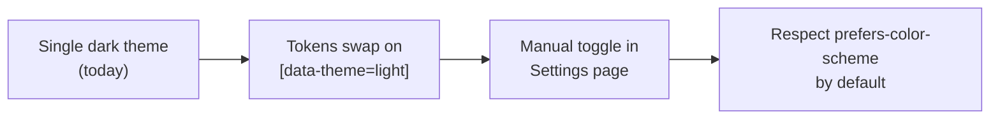

# Design System

The Creditra design system is two files plus a Figma source-of-truth:

- `src/index.css` — runtime CSS custom properties consumed by every component
- `src/utils/tokens.ts` — TypeScript constants for components that style with inline
  `React.CSSProperties` (e.g. SVG fills on the risk gauge, badge palettes)
- [`Design System/`](../Design%20System/) — Figma-anchored reference for the canonical
  values

Any change that introduces a one-off color, spacing value, or radius is a review blocker.
Extend the token table instead.

---

## 1. Token catalogue

### Color

Semantic tokens (from `:root` in `src/index.css`):

| Token | Value | Used for |
| --- | --- | --- |
| `--bg` | `#0d1117` | App background |
| `--surface` | `#161b22` | Cards, header, inputs |
| `--surface-raised` | `#1c2230` | Elevated surfaces over a card (additive) |
| `--surface-overlay` | `rgba(13,17,23,0.72)` | Modal backdrop |
| `--border` | `#30363d` | Card/input borders, dividers |
| `--text` | `#e6edf3` | Primary body text |
| `--muted` | `#8b949e` | Secondary text, placeholder |
| `--accent` | `#58a6ff` | Primary action, links, focus ring |
| `--success` | `#3fb950` | Positive status, repayments, low utilization |
| `--warning` | `#d29922` | Suspended status, medium utilization |
| `--error` | `#f85149` | Defaulted status, danger, high utilization |

Per-domain palettes (from `src/utils/tokens.ts`):

| Domain | Source | Mapping |
| --- | --- | --- |
| Credit-line status | `STATUS_COLOR` | `Active` → green; `Suspended` → amber; `Defaulted` → red; `Closed` → grey. Each entry is a `{bg, color, border}` triple tuned for AA contrast against `--surface`. |
| Utilization | `UTIL_COLOR` | `low` → success; `medium` → warning; `high` → danger. Threshold logic in `getUtilizationLevel(utilized, limit)`. |
| Risk score | `RISK_COLOR(score)` | `>= 700` → success; `>= 600` → warning; otherwise → danger. |
| Transaction type | `Dashboard.tsx:TX_COLOR` | `Draw` → danger; `Repay` → success; `Fee` → muted; `Interest` → warning. |

The Figma layer adds primitive scales (`rich-black/50…500`, `black/50…500`, `grey/50…500`,
`blue/50…500`, `green/50…500`) documented in
[`Design System/tokens.md`](../Design%20System/tokens.md). The runtime tokens above are the
semantic layer that resolves to these primitives.

### Spacing

Defined as CSS custom properties; every component reads them via `var(--space-*)`.

| Token | Value |
| --- | --- |
| `--space-xs` | `0.25rem` (4 px) |
| `--space-sm` | `0.5rem` (8 px) |
| `--space-md` | `0.75rem` (12 px) |
| `--space-lg` | `1rem` (16 px) |
| `--space-xl` | `1.5rem` (24 px) |
| `--space-2xl` | `2rem` (32 px) |

### Radii

| Token | Value | Used for |
| --- | --- | --- |
| `--radius-sm` | `4px` | Pills, chips, badges |
| `--radius-md` | `6px` | Buttons, inputs, cards |
| `--radius-lg` | `10px` | Modal containers, prominent surfaces |
| `--radius-pill` | `9999px` | Status dots, full-pill controls |

### Elevation

The system is intentionally flat. Elevation is communicated through *surface tone*, not
shadow:

| Token | Use |
| --- | --- |
| `--surface` | Default card / header |
| `--surface-raised` | Hover or selected state for cards |
| `--surface-overlay` | Modal backdrop (carries alpha so the page is dimmed but visible) |

The Figma layer defines `.shadow-sm`, `.shadow-md`, `.shadow-lg`, `.shadow-xl`,
`.shadow-none` for documents and marketing surfaces. The product UI does not use shadow.

### Typography

Line-height rhythm tokens drive vertical density:

| Token | Value | Applies to |
| --- | --- | --- |
| `--lh-display` | `1.2` | Display headings |
| `--lh-heading` | `1.3` | `h1`–`h6` |
| `--lh-body` | `1.6` | Body copy, `
` |
| `--lh-small` | `1.5` | Caption text |

Font stack: `system-ui, -apple-system, sans-serif` — declared on `body`. No web font is
loaded; this keeps CLS at zero and removes a third-party request.

### Motion

Animations live in component CSS files; durations target 150–300 ms easing
`cubic-bezier(0.16, 1, 0.3, 1)`. Every animation is gated by
`@media (prefers-reduced-motion: reduce)`:

| File | What is gated |
| --- | --- |
| `src/index.css` | Two top-level reduced-motion blocks killing decorative animation |
| `src/components/Skeleton.css` | Shimmer animation paused |
| `src/components/OnboardingFlow.css` | Step transitions disabled |
| `src/components/WalletConnectionModal.css` | Sheet slide-in disabled |
| `src/components/FormField.css` | Inline error fade disabled |
| `src/components/LandingPage.css` | Hero animation disabled |

Framer Motion is used for the onboarding stepper and the landing hero; both call
`useReducedMotion()` so animation is conditionally suppressed at the JS level too
(see `LandingPage.tsx`).

---

## 2. Component library inventory

Every component below lives in `src/components/`.

### Inputs and form primitives

| Component | Purpose | A11y contract |
| --- | --- | --- |
| `FormField` | Labelled input/textarea/custom child with help and error slots | `htmlFor` linkage, `aria-describedby`, `aria-invalid`, `aria-required` set automatically; required indicator announced |
| `FormMessage` | Tone-coded helper/error text | `role="alert"` for `danger`; live region wrapping for transient feedback |
| `AmountInput` | Currency input with preset chips (25/50/75/100%) and per-severity feedback | `aria-describedby` aggregates helper + constraint + status + error IDs |
| `PendingButton` | Submit button with inline spinner | `aria-busy="true"` while loading; spinner `aria-hidden` so label-change communicates state |

### Status, feedback, success

| Component | Purpose | Notes |
| --- | --- | --- |
| `StatusBadge` | Pill for `CreditLineStatus` | Color + glyph cue (`A`, `!`, `X`, `C`) so meaning survives monochrome screenshots |
| `Skeleton` | Shimmer placeholder | Animation respects `prefers-reduced-motion` |
| `SuccessState` | Post-action confirmation | `role="status" aria-live="polite"` |
| `TransactionStatus` | Pending / success / failure for draws and repays | Step indicator + retry CTA |
| `ErrorBoundary` | Class-component render guard | Renders `ErrorPage` with semantic landmarks |

### Overlay

| Component | Purpose | Composed hooks |
| --- | --- | --- |
| `WalletConnectionModal` | Pick wallet, see install state | `useFocusTrap` + `useBodyScrollLock` + `useInertBackdrop` |
| `RepayModal` | Repay flow with input + confirm + status | `useFocusTrap` |
| `OnboardingFlow` | 3-step intro for first-time wallet users | Framer Motion + `useReducedMotion` |

### Wallet

| Component | Purpose |
| --- | --- |
| `WalletButton` | Header CTA; switches between "Connect" and connected-chip; surfaces wallet dropdown |

### Credit-line UI

| Component | Purpose |
| --- | --- |
| `CreditLineSelector` | First step of the draw wizard |
| `CreditLineSummaryBlock` | Card summarising a single credit line |
| `CreditLineDetailDrawer` | Slide-out sheet summarizing credit line details, trend, and transactions |
| `PreviewSection` | Pre-confirmation preview of a draw |
| `ConfirmationStep` | Final confirm step with APR + total cost |

### A11y primitives

| Component | Purpose |
| --- | --- |
| `AccessibleTooltip` | Keyboard-focusable info trigger; `role="tooltip"` + `aria-describedby` |
| `CopyToClipboard` | Real `button` with `aria-label`, success affordance announced via polite live region (`Copy` → `Copied` for 2 s) |

### Notifications system (`src/components/notifications/`)

| Component | Purpose |
| --- | --- |
| `NotificationBell` | Header trigger with unread badge; 44×44 px target |
| `NotificationCenter` | Side panel with category filters, mark-read, clear-all |
| `ToastContainer` | Stack of transient toasts |
| `BannerAlert` | Page-level alert with action + dismiss |
| `notificationIcons.tsx` | Per-type icon set |

---

## 3. Theming

The app currently ships a single, opinionated **dark theme**. That is a product choice for
the initial release — finance UIs read better in low light during night-time market
activity, and our user research showed strong preference for a dark default.

Hooks are already in place for a light theme:

- **CSS custom properties** make the swap trivial — re-declaring the same `:root` keys
  inside `[data-theme="light"]` would flip the entire UI without component changes.
- **`prefers-color-scheme: dark`** is honoured in `WalletConnectionModal.css`, which is
  where the first hook for OS-driven theming was added.
- **Token-only inline styles** (`src/utils/tokens.ts`) need a second pass — they currently
  return hex literals tied to the dark palette. The fix is to read from
  `getComputedStyle(document.documentElement)` instead.

Planned rollout:

The toggle UX will be a tri-state radio — `System | Light | Dark` — persisted to
`localStorage` via the existing `src/utils/storage.ts` safe wrappers.

---

## 4. Density rules

Density is a function of *what a screen is for*, not a single user setting.

| Screen class | Vertical rhythm | Pattern |
| --- | --- | --- |
| Dashboard summary | Loose — `--space-xl` between cards, `--space-lg` inside | Reading-first, scannable, generous whitespace |
| Tables (Transactions, Credit Lines) | Tight — `--space-md` row padding, `--space-sm` between columns | Compare-first, density helps comparison |
| Forms (Draw wizard, Auth, Evaluation) | Medium — `--space-lg` between fields, `--space-md` inside fields | Read-and-act, one field of focus at a time |
| Modals | Medium — same as forms | Single task in a constrained surface |

Touch targets stay at 44×44 px regardless of density (see [`ACCESSIBILITY.md`](ACCESSIBILITY.md)).

---

## 5. Motion principles

1. **Motion communicates state change, never decoration.** A skeleton shimmer says "this
   is loading"; a success checkmark sweep says "this completed". Motion that does not
   answer "what changed?" is removed.
2. **150–300 ms.** Anything longer feels slow on a finance UI where users repeat actions.
3. **Easing carries direction.** Enter animations ease-out (decelerating arrival); exit
   animations ease-in (accelerating departure). The shared curve is
   `cubic-bezier(0.16, 1, 0.3, 1)`.
4. **`prefers-reduced-motion` collapses to instant.** No animation, no transition. Every
   stylesheet listed in section 1 enforces this.
5. **Framer Motion is OK for compound transitions** (e.g. step transitions in
   `OnboardingFlow`), CSS is preferred for everything else.

---

## 6. Visual examples

### Risk gauge (Dashboard)

Implemented inline in `src/pages/Dashboard.tsx` as an SVG semicircle. A 180° arc from
`(cx - r, cy)` to `(cx + r, cy)` is drawn twice — a muted background path and a coloured
foreground path. The foreground's `strokeDashoffset` is computed from the normalised
score (`0–100`). The colour comes from `RISK_COLOR(score)` and the trend arrow is
`▲ | ▼ | ─` paired with `improving | declining | stable` text — never colour alone.

### Status badge

`StatusBadge` pairs a tinted pill with a single-letter glyph (`A`, `!`, `X`, `C`). The
pill's `background`, `color`, and `borderColor` come from `STATUS_COLOR[status]`. Even in
greyscale, the glyph distinguishes Active from Suspended from Defaulted from Closed.

### Header active link

`.header-nav-link.active` adds three indicators on top of the accent colour: a 2 px bottom
border, a font-weight bump to 600, and an 8 %-opacity accent background. `aria-current="page"`
is set on the active link. This is the canonical demonstration of WCAG 1.4.1 (Use of
Color) plus 2.4.8 (Location) in the codebase.

### Skeleton shimmer

`components/Skeleton.css` defines the shimmer keyframes and the
`@media (prefers-reduced-motion: reduce)` block that disables them. The component is a
`
` with `width`/`height` passed through props so a loading state can match its target
layout exactly.

### Modal backdrop

The modal backdrop is `--surface-overlay` (a 72 %-alpha layer over `--bg`) so the page
behind remains legible but de-emphasised. Background content is also marked `inert` so
assistive tech skips it entirely.
