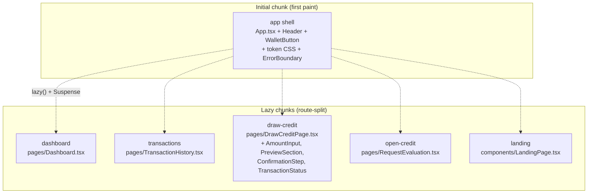

# Performance

Performance budgets are part of the design system, not a separate concern. A
slow finance app is an inaccessible finance app — slow inputs cause double-submits, slow
loads cause refresh-loops, and both translate into customer-support burden.

This document fixes the targets we hold ourselves to, the strategy for hitting them, and
the enforcement points in the build.

---

## 1. Core Web Vitals budgets

| Metric | Budget (p75 mobile) | Budget (p75 desktop) | Why |
| --- | --- | --- | --- |
| **LCP** (Largest Contentful Paint) | ≤ 2.0 s | ≤ 1.5 s | Dashboard's risk gauge or the summary tile is the LCP; users decide if they trust the page in the first ~2 s. |
| **INP** (Interaction to Next Paint) | ≤ 150 ms | ≤ 100 ms | Repay / draw inputs must feel instant; INP regression is the canary for a noisy main thread. |
| **CLS** (Cumulative Layout Shift) | ≤ 0.05 | ≤ 0.05 | Money fields must not shift while a user is targetting a button. We hold a stricter budget than Google's 0.1 "good" threshold. |
| **TTFB** | ≤ 600 ms | ≤ 400 ms | Hosting-driven. CDN is required. |
| **TBT** (lab proxy for INP) | ≤ 200 ms | ≤ 100 ms | Used by Lighthouse in CI. |

Budgets apply on a **3G Fast / 4× CPU slowdown** Lighthouse profile for mobile, and on a
**desktop / 1× CPU** profile for desktop.

---

## 2. Code-splitting strategy

The current build ships a single bundle. The migration path to per-route splitting is
documented below — it is the next performance investment after `vite-plugin-pwa` lands.

### Target shape



### How to convert

In `src/App.tsx`:

```tsx
import { lazy, Suspense } from 'react';
import { Skeleton } from './components/Skeleton';

const Dashboard           = lazy(() => import('./pages/Dashboard'));
const TransactionHistory  = lazy(() => import('./pages/TransactionHistory'));
const DrawCreditPage      = lazy(() => import('./pages/DrawCreditPage'));
const RequestEvaluation   = lazy(() => import('./pages/RequestEvaluation'));

// ...

<Suspense fallback={<Skeleton height={400} />}>
  <Routes>{/* … */}</Routes>
</Suspense>
```

Vite splits each `lazy()` boundary into its own chunk automatically. The wallet modal,
onboarding flow, and repay modal stay in the shell because they're triggered from the
header and any page.

---

## 3. Asset policy

### Images

- **SVG everywhere it makes sense.** The risk gauge, status badges, wallet icons, and
  success checkmark are all SVG, drawn inline. No raster fallback.
- **Inline small SVGs**, host larger ones in `public/`. Anything ≥ 4 KB goes to disk.
- **No web fonts.** The font stack is `system-ui, -apple-system, sans-serif` so we ship
  zero font bytes and have zero `font-display` to worry about.

### Icons

- `lucide-react` is the canonical icon library. Each icon imports as a separate symbol,
  so tree-shaking keeps the bundle lean.
- Decorative icons get `aria-hidden="true"` and a paired text label so screen readers
  don't double-announce.

### Third-party

The only runtime third-party scripts are wallet extensions, which are user-installed and
not loaded by us. There is no analytics tag, no marketing pixel, no chat widget. If one
ships, it is loaded async after `load` and is conditional on consent.

---

## 4. Bundle-size budgets per route

These are the budgets we enforce when route-splitting lands. Numbers are **gzipped**.

| Chunk | Budget | Rationale |
| --- | --- | --- |
| **shell** (initial) | ≤ 80 KB | App.tsx, Router, ErrorBoundary, WalletProvider, NotificationProvider, Header, WalletButton, tokens — everything every route needs |
| **`/` Dashboard** | ≤ 25 KB | Risk gauge SVG, summary, transactions preview |
| **`/transactions`** | ≤ 35 KB | Sortable table, filter chips, time-range selector |
| **`/credit-lines`** | ≤ 25 KB | Sortable list and per-line summary |
| **`/draw-credit`** | ≤ 40 KB | 5 step components + amount validation |
| **`/open-credit`** | ≤ 20 KB | Single multi-field form |
| **landing** | ≤ 50 KB | Framer Motion + hero + FAQ; only loaded on the public landing |
| **modals (in shell)** | ≤ 25 KB | WalletConnectionModal + OnboardingFlow + RepayModal |

Total **first paint** budget: 80 KB shell + the route the user landed on. For a cold
Dashboard load that's ≤ 105 KB gzipped. A typical first-time landing → connect → onboard
flow stays under 200 KB.

### Reading the budget

If a PR raises a chunk above its budget, the PR author must either:

1. Show how the additional bytes are paid back in user value, and raise the budget here
   in the same PR; or
2. Defer the new code behind a `lazy()` boundary.

We do not silently ship over budget.

---

## 5. Render performance

- **`React.StrictMode` is on** in `src/main.tsx`. We tolerate the double-render in dev
  because the runtime checks catch state-mutation and effect-cleanup bugs early.
- **`useMemo` and `useCallback` are used surgically** — only where a child consumer is
  memoized or an effect depends on the value. The Dashboard's `useMemo` over computed
  KPIs and the NotificationContext's `useCallback` over the dispatcher set are the
  canonical examples.
- **No inline object literals in hot paths.** Style objects on the risk gauge and status
  badge are hoisted to module scope (see `src/utils/tokens.ts`).
- **Skeletons match final layout** so the painted area is stable across the loading →
  ready transition and CLS stays at 0.

---

## 6. Network performance

- **No request waterfall on first paint.** The shell renders without waiting on any
  network request. Risk score / credit lines fetch happens in `useEffect` after first
  paint.
- **`fetch` is preferred over a heavyweight HTTP client.** No axios, no SWR (yet —
  see [`UX_RATIONALE.md`](UX_RATIONALE.md) §6).
- **`localStorage` is the only client cache today.** Notifications and wallet preference
  use the safe wrappers in `src/utils/storage.ts`, which fail closed on quota and parse
  errors so the UI never crashes on bad storage state.

---

## 7. Enforcement

| Enforcement point | What it checks | Where it runs |
| --- | --- | --- |
| `vite build` | Per-chunk gzip size printed in the build summary | Locally and CI |
| Lighthouse CI (recommended) | LCP/INP/CLS/TBT against the budgets above | CI on every PR |
| `@axe-core/react` (recommended) | A11y regressions that also frequently surface perf regressions | CI on every PR |
| Bundle visualizer (`rollup-plugin-visualizer`, recommended) | Per-chunk treemap when a budget is breached | Local |

When budgets are breached, the recovery order is: (1) lazy-split, (2) shrink dependency,
(3) raise the budget *with justification in this file*.

---

## 8. Known regressions / opportunities

- `framer-motion` is imported by both `LandingPage` and `OnboardingFlow`. After route
  splitting, it should only live in those chunks.
- `lucide-react` icons are imported as named exports throughout — verify tree-shaking is
  pruning unused symbols after the next build.
- The vendored `next` dependency in `package.json` is an artifact and should be removed
  in a separate `chore:` PR; it ships zero code into our bundle today but adds install
  time.
- The shimmer in `Skeleton.css` uses `background-position` animation; if the painted
  surface area grows, switch to a `transform: translateX` overlay to keep the animation
  on the compositor.
