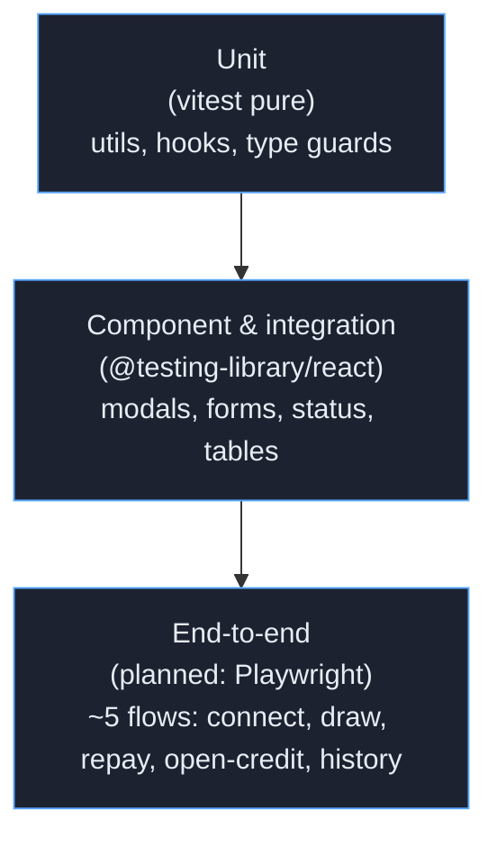

# Testing

## Transaction history CSV export

`src/utils/csv.test.ts` verifies RFC-style escaping for commas, quotes,
and newlines without adding a third-party CSV dependency.

`src/pages/TransactionHistory.test.tsx` covers the disabled export state,
the `aria-describedby` explanation, and the polite confirmation toast shown
after a filtered export completes.


Tests are how we make execution quality visible to reviewers. They also keep regressions
out of the rendered surface where they would cost users money. This document is the
testing strategy plus a snapshot of where we are today.

---

## 1. Test pyramid



The base is heavy on purpose. Most of the logic worth testing in a finance UI lives in
deterministic pure functions (currency, dates, address formatting, amount validation,
storage wrappers). Component tests assert the a11y contract and user-visible state
transitions. End-to-end tests verify the assembled flows.

| Tier | What goes here | When to add |
| --- | --- | --- |
| **Unit** | Anything pure: formatters, validators, classnames helpers, type guards | Always — every new util gets a test in the same PR |
| **Component** | Rendered React, queried by role, simulated user events | When a component has state, an a11y contract, or a non-trivial conditional render |
| **Integration** | A page rendered with its providers, mocking only the network boundary | When a flow spans more than one component (e.g. draw wizard) |
| **End-to-end** | Real browser, real wallet stub, real navigation | For golden-path flows that span the wallet, providers, and multiple pages |

---

## 2. Stack

| Tool | Use |
| --- | --- |
| [`vitest`](https://vitest.dev/) | Test runner; ESM-native, Vite-aware |
| `jsdom` | DOM environment, configured in `vitest.config.ts` |
| `@testing-library/react` | Render and query helpers; encourages role-based queries |
| `@testing-library/jest-dom` | DOM assertion matchers (`toBeInTheDocument`, `toHaveAttribute`, etc.) |
| `@testing-library/user-event` | Realistic keyboard and pointer event simulation |
| Vitest globals | `test`, `it`, `expect`, `describe` available without imports (configured via `tsconfig.json:types: ["vitest/globals"]`) |

The test setup lives in `src/test/setup.ts` and is loaded via the
`setupFiles: ['./src/test/setup.ts']` entry in `vitest.config.ts`.

---

## 3. Inventory (today)

- **18 test files** under `src/` (`find src -name '*.test.*' | wc -l`)
- **98 `test()` / `it()` blocks** total (`grep -rE 'test\(|it\(' src | wc -l`)
- **75 test cases executed** by Vitest. Currently 63 passing + 12 failing.

### Files

| File | Concern |
| --- | --- |
| `src/App.test.tsx` | Top-level route shell, navigation, header semantics |
| `src/utils/amountValidation.test.ts` | Draw and repay validation severity transitions |
| `src/utils/classnames.test.ts` | Helper for joining class names with falsy filtering |
| `src/utils/currency.test.ts` | Currency formatter |
| `src/utils/dates.test.ts` | `timeAgo`, `isSameDay` helpers |
| `src/utils/format-address.test.ts` | Stellar address truncation |
| `src/utils/storage.test.ts` | Safe localStorage wrappers (parse/quota failure handling) |
| `src/components/AccessibleTooltip.test.tsx` | Tooltip ARIA wiring |
| `src/components/AmountInput.test.tsx` | Input + preset behaviour + validation feedback |
| `src/components/CopyToClipboard.test.tsx` | Copy button label flip + a11y announcement |
| `src/components/ErrorBoundary.test.tsx` | Render-error fallback |
| `src/components/Skeleton.test.tsx` | Skeleton dimensions + prefers-reduced-motion |
| `src/components/StatusBadge.test.tsx` | Color/glyph mapping per status |
| `src/components/__tests__/WalletConnectionModal.test.tsx` | Focus trap, escape close, install-state visual differentiation |
| `src/hooks/__tests__/useFocusTrap.test.tsx` | Tab cycling, Shift+Tab cycling, Escape, return-focus |
| `src/pages/Dashboard.test.tsx` | Dashboard summary and risk-gauge render |
| `src/pages/NotFound.test.tsx` | 404 semantic structure |
| `src/pages/TransactionHistory.test.tsx` | Sortable headers + filter chips |

### Known failures (out of scope here)

`src/App.test.tsx` currently throws because it renders `<App />` containing its own
`BrowserRouter`, conflicting with the test harness expectations. The remaining 11
failures cascade from the same setup. These are tracked separately and **must not** be
worsened by docs-only or comment-only PRs — see [`UX_RATIONALE.md`](UX_RATIONALE.md) for
the constraint policy.

---

## 4. How to run each tier

### Unit + component (everything we ship today)

```bash
npm test              # vitest watch mode (best for iterating)
npm test -- --run     # one-shot CI mode
```

### Coverage

```bash
npm test -- --coverage --run
```

Vitest will print a per-file table to stdout. Coverage thresholds are not enforced in
`vitest.config.ts` yet; the recommended thresholds for the first enforcement pass are
80 % statements, 75 % branches across `src/utils/`.

### A single file or a single test

```bash
npm test -- AmountInput.test         # only that file
npm test -- -t "validates max draw"  # only that test name
```

### Lint

```bash
npm run lint
```

### Production build (also runs the type-checker)

```bash
npm run build
```

A successful `tsc -b` means the type graph is consistent. A successful `vite build` means
the bundle is sound. Run both before opening a PR.

### End-to-end (planned)

A Playwright setup is the next testing investment. The five flows we want covered:

1. **Connect** — open the wallet modal, mock Freighter, verify the connected chip.
2. **Onboard** — first-time user sees the stepper, completes, returns to dashboard.
3. **Draw** — select line, enter amount, confirm, see success state, see transaction in
   history.
4. **Repay** — open repay modal, validate amount, confirm, see balance update.
5. **Open credit line** — submit evaluation form, see pending state.

Tests will live under `e2e/` and run in CI against a built `dist/` served with
`vite preview`.

---

## 5. Conventions for new tests

1. **Query by role first.** `getByRole('button', { name: /repay/i })` beats
   `getByTestId('repay-btn')`. The test then doubles as an a11y contract check.
2. **Assert behaviour, not implementation.** "Pressing Escape closes the modal" is a
   behaviour. "`onEscape` was called" is an implementation detail.
3. **Co-locate.** Tests for `Foo.tsx` live in `Foo.test.tsx` next to it. The
   `__tests__/` folders exist for historical reasons and are tolerated; new tests
   should be co-located.
4. **Use `user-event`, not `fireEvent`.** `user-event` is the realistic simulator;
   `fireEvent` skips the keyboard/focus invariants that matter most in a11y tests.
5. **One assertion per visible outcome.** Multiple `expect` calls are fine when they
   describe one outcome (e.g. "the modal is visible and the trigger is no longer
   focused").
6. **No real network.** Mock at the `fetch` boundary or below. The backend is out of
   scope for frontend tests.

---

## 6. CI expectations

The PR check pipeline runs:

```bash
npm ci
npm run lint
npm test -- --run
npm run build
```

If any of these fail, the PR is not mergeable. Pre-existing failures inherited from main
do not block docs-only or comment-only PRs (see [`CONTRIBUTING.md`](CONTRIBUTING.md)),
but they must not be worsened. The diff has to be neutral or positive on the test count
and on the type-check.
